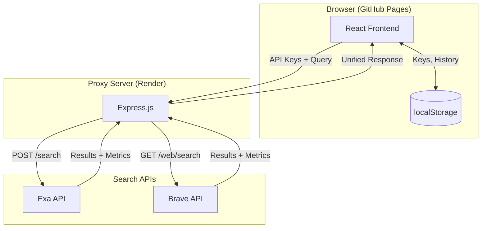
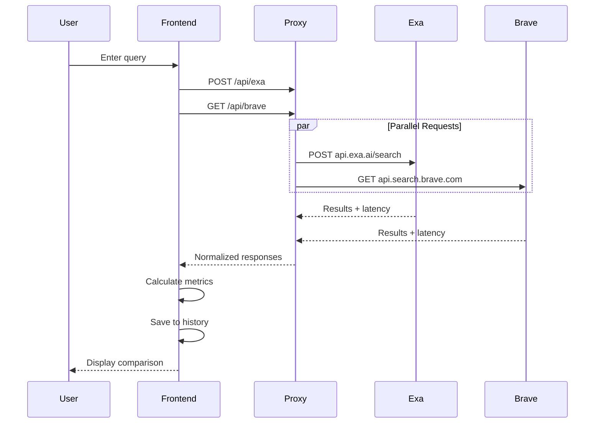

# Search Compare

A side-by-side comparison tool for evaluating search API providers. Run the same query against multiple providers and compare results, latency, and costs in real-time.

**Live Demo:** https://aj-botpress.github.io/search-compare/
*(Bring your own API keys — first request may be slow due to cold start)*

## Supported Providers

| Provider | Type | Pricing |
|----------|------|---------|
| [Exa](https://exa.ai) | Neural/semantic search | $5 per 1,000 queries |
| [Brave Search](https://brave.com/search/api/) | Traditional web search | Free 2K/mo, then $5 per 1,000 |

## Features

- **Side-by-side results** — Same query, both providers, instant comparison
- **Real-time metrics** — Latency, result count, cost per query
- **Search history** — Review past searches, re-run queries, export to CSV
- **Local storage** — API keys and history persist in browser
- **Terminal aesthetic** — Data-dense, monospace UI

## Architecture



## Data Flow



## Project Structure

```
search-compare/
├── src/
│   ├── components/
│   │   ├── ApiKeyPanel.tsx     # API key inputs with validation
│   │   ├── SearchInput.tsx     # Query input + result count
│   │   ├── StatsGrid.tsx       # Metrics dashboard
│   │   ├── ResultsColumn.tsx   # Single provider results
│   │   └── HistoryView.tsx     # Past searches + export
│   ├── lib/
│   │   ├── api.ts              # API client functions
│   │   └── storage.ts          # localStorage helpers
│   ├── types.ts                # TypeScript interfaces
│   └── App.tsx                 # Main application
├── server/
│   └── index.js                # Express proxy server
└── render.yaml                 # Render deployment config
```

## Getting Started

### Prerequisites

- Node.js 18+
- API keys from [Exa](https://exa.ai) and/or [Brave](https://brave.com/search/api/)

### Local Development

```bash
# Install dependencies
npm install
cd server && npm install && cd ..

# Start dev server (frontend + proxy)
npm run dev
```

This starts:
- Frontend at `http://localhost:5173`
- Proxy server at `http://localhost:3001`

### Production Deployment

**Frontend:** Deployed to GitHub Pages via GitHub Actions on push to `main`.

**Proxy Server:** Deploy to Render using the blueprint:

[](https://dashboard.render.com/select-repo?type=blueprint)

Or manually:
1. Create a new Web Service on Render
2. Point to this repo, set root directory to `server`
3. Build command: `npm install`
4. Start command: `npm start`

## API Reference

### Proxy Endpoints

```
POST /api/exa
Headers: x-api-key: <your-exa-key>
Body: { query, numResults, type, contents }

GET /api/brave?q=<query>&count=<num>
Headers: X-Subscription-Token: <your-brave-key>
```

### Response Format

Both endpoints return normalized results with server-side latency:

```typescript
interface SearchResponse {
  results: SearchResult[];
  metrics: {
    latencyMs: number;
    resultCount: number;
    costUsd: number;
    timestamp: number;
  };
  error?: string;
}
```

## Tech Stack

- **Frontend:** React 19, TypeScript, Tailwind CSS 4, Vite
- **Backend:** Express.js (proxy only)
- **Hosting:** GitHub Pages (frontend), Render (proxy)
- **Charts:** Recharts
- **Icons:** Lucide React

## License

MIT
